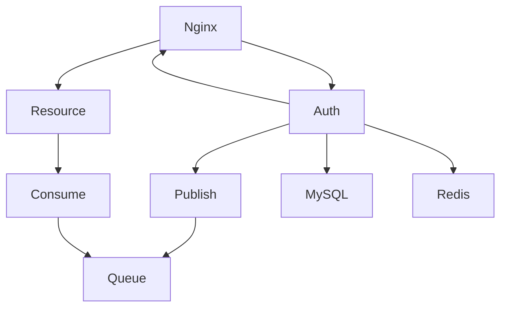
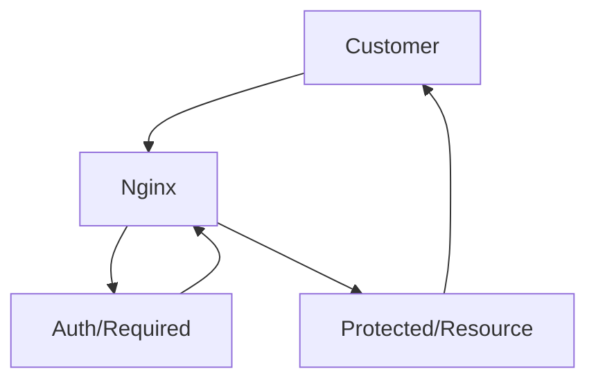
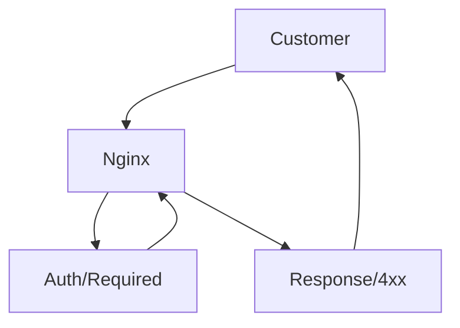

# 📚 Vasa Knjiga Auth
Vasa Knjiga Auth is auth system build in [node.js](https://nodejs.org/en/). Architecture is service oriented that communicate via message queue or direct REST API calls.

## Features
- Authentication
- Authorization
- Session managment
- 2fa (soon)
- Permissions by group
- Verification
- Password Reset
- Configurable

## 📋 Prerequisites
[MySQL](https://mysql.com), [Redis](https://redis.io/), [RabbitMQ](https://www.rabbitmq.com/)

- If you are not sure how to host it. Here is how to host your MySQL database on [windows](https://www.cloudways.com/blog/configure-virtual-host-on-windows-10-for-wordpress/), if you are a linux user you can follow this tutorial [linux ubuntu >= 19.04](https://www.geeksforgeeks.org/hosting-mysql-server-on-linux/), for Mac users [MacOS](https://medium.com/macoclock/mysql-on-mac-getting-started-cecb65b78e).

- You need to host your Redis server, [download link](https://redis.io/download/).

- If you wish to start fast on RabbitMQ, there is cloud hosting, that hosts your RabbitMQ service for free (not production ready) [CloudAMQP](https://www.cloudamqp.com/). Otherwise, instructions how to install RabbitMQ on your machine. [Download and Installing RabbitMQ](https://www.rabbitmq.com/download.html)

#### Where does Auth Server stand in service oriented architecture
Vasa Knjiga Auth is isolated, closely related with nginx api gateway. It can communicate via message queues to other microservices.
You can use [vasaknjiga_gateway](https://github.com/vojinpavlovic/vasaknjiga_gateway)



#### How does session managment work with microservices
It's behavior is to either send 2xx for success or 4xx for failure as subrequest for nginx and nginx will either proxy pass if 2xx or return 4xx response to customer.

- Case when auth/required returns 2xx status http code


- Case when auth/required returns 4xx status http code


## ⚙️ Env configuration
In order to run auth server, first you would need to configure enviornment file.
Create .env file in root directory, copy the code block below. For more information of which type and is there default value you can check table below

| Param | Type | Desc | Default |
--- | --- | --- | --- |
| PORT | Int  | Auth Port that server listens to | 3000 |
| DB_CONN_LIMIT | Int | Maximum connection in pool | 20 |
| DB_HOST | String | Ip or url to your MySQL database | None |
| DB_PORT | Int | Port that your MySQL database listens to | None |
| DB_USER | String | User for your MySQL database | None |
| DB_PASSWORD | String | Password for your user | None |
| DB_DATABASE | String | Database for credentials data | None |
| REDIS_URL | String | Url to your Redis database | None |
| REDIS_PASS | String | Password to your Redis database | None |
| AMQP_URL | String | Url to your AMQP RabbitMQ message broker | None |
```
PORT=3000

DB_CONN_LIMIT=20
DB_HOST=""
DB_PORT=3306
DB_USER=""
DB_PASSWORD=""
DB_DATABASE=""

REDIS_URL=""
REDIS_PASS=""
AMQP_URL=""
```

## 🗀 Folder Structure
I follow simple folder structure that you can find below. 

```
    .
    ├── # Top level directory
        ├── src # Source Files
            ├── config # Here stands the whole configurations for a application 
            ├── helpers # Function that execute specific mini tasks
            ├── routes # All routes handlers
            ├── sql # SQL or database operations
            ├── startup # Startup processes in example as mysql, rabbitmq and redis connections
            ├── utils # Functions that return, print formatted strings or for debugging
```

## 🪣 Third Party Libaries
- [express](https://www.npmjs.com/package/express)
- [express-session](https://www.npmjs.com/package/express-session)
- [amqplib](https://www.npmjs.com/package/amqplib)
- [bcrypt](https://www.npmjs.com/package/bcrypt)
- [redis](https://www.npmjs.com/package/redis)
- [connect-redis](https://www.npmjs.com/package/connect-redis)
- [dotenv](https://www.npmjs.com/package/dotenv)
- [mysql](https://www.npmjs.com/package/mysql)
- [validator](https://www.npmjs.com/package/validator)
- [pm2](https://www.npmjs.com/package/pm2)

## MIT License 
> Permission is hereby granted, free of charge, to any person obtaining
> a copy of this software and associated documentation files (the
> "Software"), to deal in the Software without restriction, including
> without limitation the rights to use, copy, modify, merge, publish,
> distribute, sublicense, and/or sell copies of the Software, and to
> permit persons to whom the Software is furnished to do so, subject to
> the following conditions:

> The above copyright notice and this permission notice shall be
> included in all copies or substantial portions of the Software.

> THE SOFTWARE IS PROVIDED "AS IS", WITHOUT WARRANTY OF ANY KIND,
> EXPRESS OR IMPLIED, INCLUDING BUT NOT LIMITED TO THE WARRANTIES OF
> MERCHANTABILITY, FITNESS FOR A PARTICULAR PURPOSE AND
> NONINFRINGEMENT. IN NO EVENT SHALL THE AUTHORS OR COPYRIGHT HOLDERS BE
> LIABLE FOR ANY CLAIM, DAMAGES OR OTHER LIABILITY, WHETHER IN AN ACTION
> OF CONTRACT, TORT OR OTHERWISE, ARISING FROM, OUT OF OR IN CONNECTION
> WITH THE SOFTWARE OR THE USE OR OTHER DEALINGS IN THE SOFTWARE.
