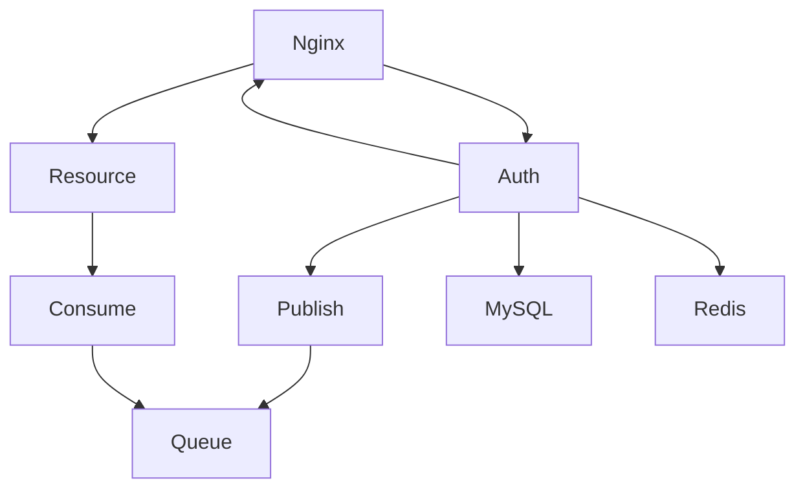
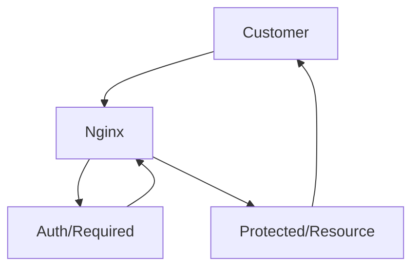
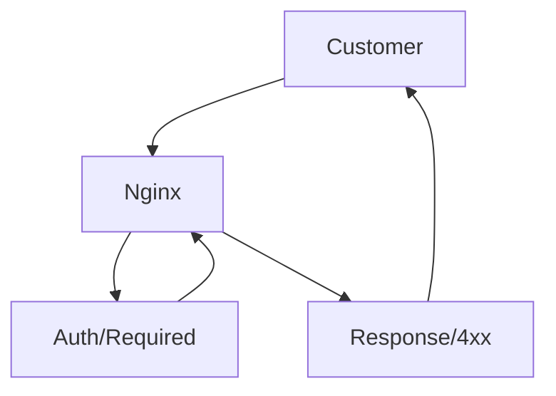

# 🔒 Auth 🔒
Auth System built in [node.js](https://nodejs.org/en/). 
Architecture is service oriented that communicate via message queue or direct REST API calls.

Table of contents
=================

<!--ts-->
  * [Features](#Features)
  * [Prerequisites](#Prerequisites)
  * [Get Started](#Get-started)
  * [How it Works](#How-it-Works)
  * [Configuration](#Configuration)
  * [Dependencies](#Dependencies)
  * [License](#License)
<!--te-->

Features
--------
- Authentication
- Authorization
- Session managment
- 2fa (soon)
- Permissions by group
- Verification
- Password Reset
- Configurable

Prerequisites
-------------
- [Nginx Gateway](https://github.com/vojinpavlovic/nginx_gateway)
- [MySQL](https://mysql.com)
- [Redis](https://redis.io/)
- [RabbitMQ](https://www.rabbitmq.com)

Get Started
-------------
In construction

How it Works
------------

#### Where does Auth Server stand in service oriented architecture
Auth server is isolated, closely related with nginx api gateway. It can communicate via message queues to other microservices.
You can use [nginx_gateway](https://github.com/vojinpavlovic/nginx_gateway)



#### How does session managment work with microservices
It's behavior is to either send 2xx for success or 4xx for failure as subrequest for nginx and nginx will either proxy pass if 2xx or return 4xx response to customer.

- Case when auth/required returns 2xx status http code


- Case when auth/required returns 4xx status http code


Configuration
-------------
Configuration is one of the project feature. Beside that, it is not clone and run, firstly it needs to be configured to mysql, redis and rabbitmq.
Create .env file and copy everything from [.env.example](https://github.com/vojinpavlovic/auth/blob/main/env.example)

### ENV Configuration

#### Node Enviornment and port
There is three types of ```NODE_ENV```, ```development```, ```test``` and ```production```. If you try to run any other enviornment, application will close.

| Param | Type | Desc | Default |
--- | --- | --- | --- |
| PORT | Int  | Port that server listens to | 3000 |
| NODE_ENV | String  | In which enviornment you want to run node app | development |

#### MySQL database
You probably noticed bold **PROD** in ```DB_PROD_CONN_LIMIT``` below in table. Since there is three enviornments PROD for production, DEV for development and TEST for test.
It is recommended to use three different databases, one for production, one for development and one for test. 

| Param | Type | Desc | Default |
--- | --- | --- | --- |
| DB_**PROD**_CONN_LIMIT | Int  | Maximum connection in MySQL pool | 10 |
| DB_**PROD**_HOST | String  | IP or URL to your database | 127.0.0.1 |
| DB_**PROD**_PORT | Int  | Port that your database listens to | 3306 |
| DB_**PROD**_USER | String  | Your MySQL user | root |
| DB_**PROD**_PASSWORD | String  | Password for your MySQL user | ```empty string``` |
| DB_**PROD**_DATABASE | String  | Your database in MySQL | unnamed_users |

#### Redis Datastore
| Param | Type | Desc | Default |
--- | --- | --- | --- |
| REDIS_**PROD**_URL | String | Url to your Redis host | 127.0.0.1 |
| REDIS_**PROD**_PORT | String | Port to your Redis host | 6379 |
| REDIS_**PROD**_PASS | String | Pass to authenticate to Redis | ```empty string``` |
| REDIS_**PROD**_DB | INT | DB in your Redis (by default there is 15) | ```1``` in PROD, ```2``` in DEV, ```3``` in TEST enviornments |

#### AMQP URL

If you wish to start fast on RabbitMQ, there is cloud hosting, that hosts your RabbitMQ service for free (not production ready) [CloudAMQP](https://www.cloudamqp.com/). Otherwise, instructions how to install RabbitMQ on your machine. [Download and Installing RabbitMQ](https://www.rabbitmq.com/download.html)

| Param | Type | Desc | Default |
--- | --- | --- | --- |
| AMQP_URL | String | Url to your AMQP | ```empty``` |

#### Prevent Accidents
By default accident prevention is disabled, but you can enable in .env for key ENABLE_ACCIDENTS_CHECK. By enabling it you need to pass ```1``` otherwise
it will be false.

First, what accidents can we prevent. Let's assume you already established Auth Server and run test, test might in future require to Truncate users table
we don't want that in dev or production, right? But that's okay test will always run in test enviornment, but accidents happens accidently, there is 
possibility to check same database name for both PROD and DEV in TEST variable. This little script will check if database names are same, if so application will not procceed to launch and will exit with error.

| Param | Type | Desc | Default |
--- | --- | --- | --- |
| ENABLE_ACCIDENTS_CHECK | String/Number | Enabling for accident checks | 0 ```false``` |

#### Routes
```
    name_of_endpoint : {
        endpoint: '/some/endpoint',
        method: 'get',
        handler: require('../routes/auth-required')
    },
```
#### Code.js

```
    "type": {
        ttl: 300,
        auth: true,
        codeBytesLengths: 64,
        handler: require('../handlers/some-handler'),
        delAfterHandling: true
    },
```
- ```ttl``` Expiration time for code in Redis Datastore. Code is auto deleted once time has passed. 
- ```auth``` There is situations where you need user to be authenticated to request code, set this to true if the case.
- ```codeBytesLengths``` Length of generated random string.
- ```handler``` When code is validated, handler is called in /verifyCode route if exist in config. Handler must return data with {success: true/false, ...rest of data}. Handler result is returned in response to end user, so be carefull what you put in return.
- ```delAfterHandling``` If handler return { success: true } it will delete code in Redis Datastore

Dependencies
-------------
- [express](https://www.npmjs.com/package/express)
- [express-session](https://www.npmjs.com/package/express-session)
- [amqplib](https://www.npmjs.com/package/amqplib)
- [bcrypt](https://www.npmjs.com/package/bcrypt)
- [redis](https://www.npmjs.com/package/redis)
- [connect-redis](https://www.npmjs.com/package/connect-redis)
- [dotenv](https://www.npmjs.com/package/dotenv)
- [mysql](https://www.npmjs.com/package/mysql)
- [validator](https://www.npmjs.com/package/validator)
- [pm2](https://www.npmjs.com/package/pm2)

License
------------- 
## Mit License
> Permission is hereby granted, free of charge, to any person obtaining
> a copy of this software and associated documentation files (the
> "Software"), to deal in the Software without restriction, including
> without limitation the rights to use, copy, modify, merge, publish,
> distribute, sublicense, and/or sell copies of the Software, and to
> permit persons to whom the Software is furnished to do so, subject to
> the following conditions:

> The above copyright notice and this permission notice shall be
> included in all copies or substantial portions of the Software.

> THE SOFTWARE IS PROVIDED "AS IS", WITHOUT WARRANTY OF ANY KIND,
> EXPRESS OR IMPLIED, INCLUDING BUT NOT LIMITED TO THE WARRANTIES OF
> MERCHANTABILITY, FITNESS FOR A PARTICULAR PURPOSE AND
> NONINFRINGEMENT. IN NO EVENT SHALL THE AUTHORS OR COPYRIGHT HOLDERS BE
> LIABLE FOR ANY CLAIM, DAMAGES OR OTHER LIABILITY, WHETHER IN AN ACTION
> OF CONTRACT, TORT OR OTHERWISE, ARISING FROM, OUT OF OR IN CONNECTION
> WITH THE SOFTWARE OR THE USE OR OTHER DEALINGS IN THE SOFTWARE.
