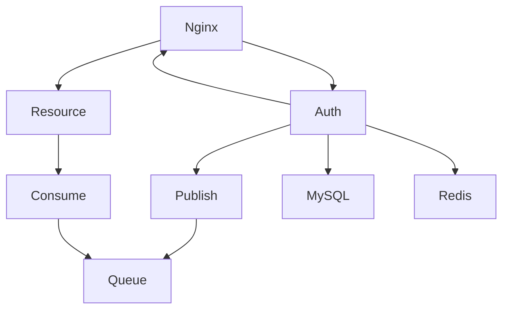
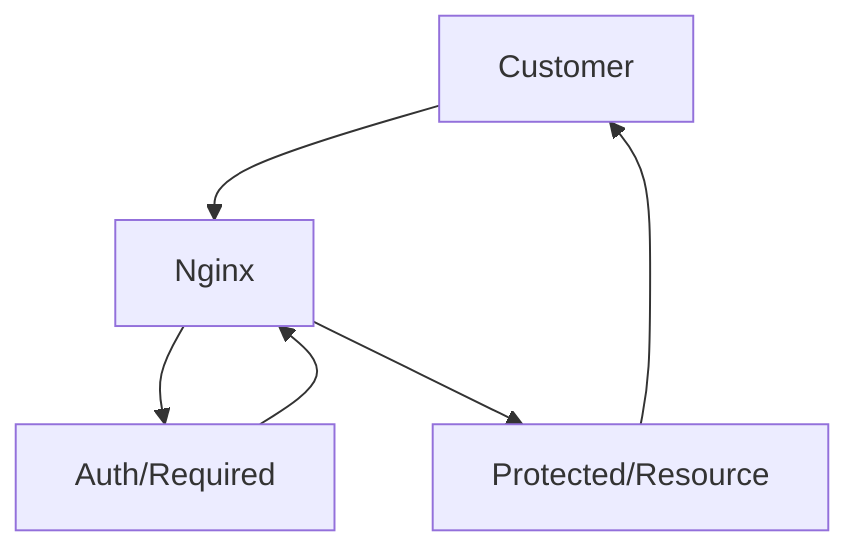
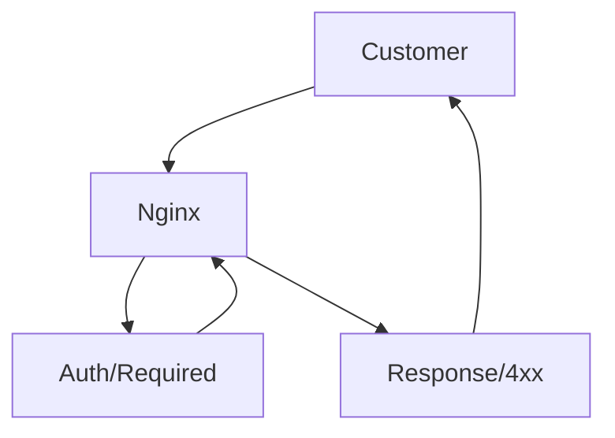

# 📚 Auth
Auth System built in [node.js](https://nodejs.org/en/). 
Architecture is service oriented that communicate via message queue or direct REST API calls.

## Features
- Authentication
- Authorization
- Session managment
- 2fa (soon)
- Permissions by group
- Verification
- Password Reset
- Configurable

## 📋 Prerequisites
- [Nginx Gateway](https://github.com/vojinpavlovic/nginx_gateway)
- [MySQL](https://mysql.com)
- [Redis](https://redis.io/)
- [RabbitMQ](https://www.rabbitmq.com)

## Get Started
In construction

#### Where does Auth Server stand in service oriented architecture
Auth server is isolated, closely related with nginx api gateway. It can communicate via message queues to other microservices.
You can use [nginx_gateway](https://github.com/vojinpavlovic/nginx_gateway)



#### How does session managment work with microservices
It's behavior is to either send 2xx for success or 4xx for failure as subrequest for nginx and nginx will either proxy pass if 2xx or return 4xx response to customer.

- Case when auth/required returns 2xx status http code


- Case when auth/required returns 4xx status http code


## ⚙️ Configuration
Configuration is one of the project feature. Beside that, it is not clone and run, firstly it needs to be configured to mysql, redis and rabbitmq.
Create .env file and copy everything from [.env.example](https://github.com/vojinpavlovic/auth/blob/main/env.example)

### ENV Configuration

#### Node Enviornment and port
There is three types of ```NODE_ENV```, ```development```, ```test``` and ```production```. If you try to run any other enviornment, application will close.

| Param | Type | Desc | Default |
--- | --- | --- | --- |
| PORT | Int  | Port that server listens to | 3000 |
| NODE_ENV | String  | In which enviornment you want to run node app | development |

#### MySQL database
You probably noticed bold **PROD** in ```DB_PROD_CONN_LIMIT``` below in table. Since there is three enviornments PROD for production, DEV for development and TEST for test.
It is recommended to use three different databases, one for production, one for development and one for test. 

| Param | Type | Desc | Default |
--- | --- | --- | --- |
| DB_**PROD**_CONN_LIMIT | Int  | Maximum connection in MySQL pool | 10 |
| DB_**PROD**_HOST | String  | IP or URL to your database | 127.0.0.1 |
| DB_**PROD**_PORT | Int  | Port that your database listens to | 3306 |
| DB_**PROD**_USER | String  | Your MySQL user | root |
| DB_**PROD**_PASSWORD | String  | Password for your MySQL user | ```empty string``` |
| DB_**PROD**_DATABASE | String  | Your database in MySQL | unnamed_users |

#### Redis Datastore
| Param | Type | Desc | Default |
--- | --- | --- | --- |
| REDIS_**PROD**_URL | String | Url to your Redis host | 127.0.0.1 |
| REDIS_**PROD**_PORT | String | Port to your Redis host | 6379 |
| REDIS_**PROD**_PASS | String | Pass to authenticate to Redis | ```empty string``` |
| REDIS_**PROD**_DB | INT | DB in your Redis (by default there is 15) | ```1``` in PROD, ```2``` in DEV, ```3``` in TEST enviornments |

#### AMQP URL

If you wish to start fast on RabbitMQ, there is cloud hosting, that hosts your RabbitMQ service for free (not production ready) [CloudAMQP](https://www.cloudamqp.com/). Otherwise, instructions how to install RabbitMQ on your machine. [Download and Installing RabbitMQ](https://www.rabbitmq.com/download.html)

| Param | Type | Desc | Default |
--- | --- | --- | --- |
| AMQP_URL | String | Url to your AMQP | ```empty``` |

#### Code.js
For verification code and password reset there is different parametres that you can customize in /lib/config/code.js

```
    "type": {
        ttl: 300,
        auth: true,
        codeBytesLengths: 64,
        handler: require('../handlers/verify-user'),
        delAfterHandling: true
    },
```
- ```ttl``` is time to live for code, once (in this example) 300 seconds pass it will be auto deleted by Redis.
- ```auth``` in case if you want for user to create new code if authenticated.
- ```codeBytesLengths``` is how big you want your string to be random generated
- ```handler``` once your code is validated in /verifyCode endpoint, if handler exist it will be called, if you wish to handle. In my example it is verify user. When user call endpoint /verifyCode endpoint, if code is valid it will run SQL to MySQL and change status from verification to active.
One rule is to return a handler with {success: true/false, ...rest-of-your-data}
- ```delAfterHandling``` it is a boolean, if you wish to use this and success is true from your handler, code will be deleted after successfull verification. In user case, once user status is changed from verification to active, it will delete such code in Redis, to tell user (if user attemps again) that code is used.

## 🪣 Third Party Libaries
- [express](https://www.npmjs.com/package/express)
- [express-session](https://www.npmjs.com/package/express-session)
- [amqplib](https://www.npmjs.com/package/amqplib)
- [bcrypt](https://www.npmjs.com/package/bcrypt)
- [redis](https://www.npmjs.com/package/redis)
- [connect-redis](https://www.npmjs.com/package/connect-redis)
- [dotenv](https://www.npmjs.com/package/dotenv)
- [mysql](https://www.npmjs.com/package/mysql)
- [validator](https://www.npmjs.com/package/validator)
- [pm2](https://www.npmjs.com/package/pm2)

## MIT License 
> Permission is hereby granted, free of charge, to any person obtaining
> a copy of this software and associated documentation files (the
> "Software"), to deal in the Software without restriction, including
> without limitation the rights to use, copy, modify, merge, publish,
> distribute, sublicense, and/or sell copies of the Software, and to
> permit persons to whom the Software is furnished to do so, subject to
> the following conditions:

> The above copyright notice and this permission notice shall be
> included in all copies or substantial portions of the Software.

> THE SOFTWARE IS PROVIDED "AS IS", WITHOUT WARRANTY OF ANY KIND,
> EXPRESS OR IMPLIED, INCLUDING BUT NOT LIMITED TO THE WARRANTIES OF
> MERCHANTABILITY, FITNESS FOR A PARTICULAR PURPOSE AND
> NONINFRINGEMENT. IN NO EVENT SHALL THE AUTHORS OR COPYRIGHT HOLDERS BE
> LIABLE FOR ANY CLAIM, DAMAGES OR OTHER LIABILITY, WHETHER IN AN ACTION
> OF CONTRACT, TORT OR OTHERWISE, ARISING FROM, OUT OF OR IN CONNECTION
> WITH THE SOFTWARE OR THE USE OR OTHER DEALINGS IN THE SOFTWARE.
