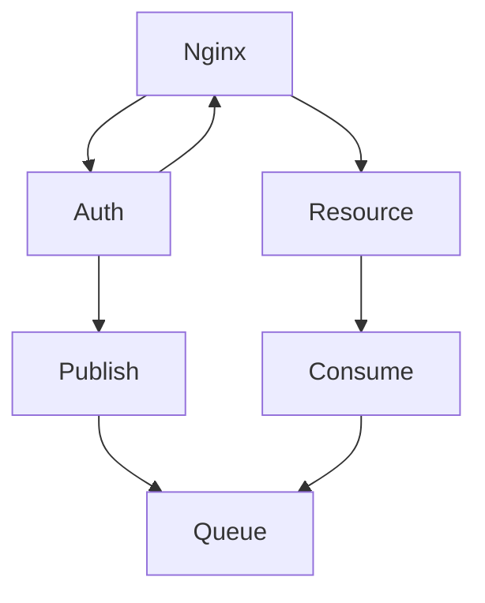
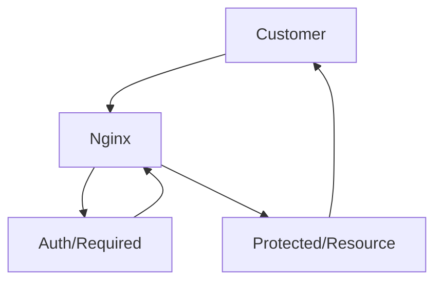
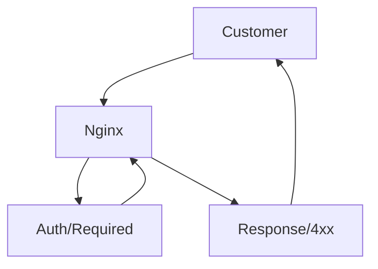

# Vasa Knjiga Auth
Vasa Knjiga Auth is auth system build in [node.js](https://nodejs.org/en/). Architecture is service oriented that communicate via message queue or direct REST API calls.

### Where does Auth Server stand in service oriented architecture
Vasa Knjiga Auth is isolated, closely related with nginx api gateway. It can communicate via message queues to other microservices.

### How does session managment work with microservices
It's behavior is to either send 2xx for success or 4xx for failure as subrequest for nginx and nginx will either proxy pass if 2xx or return 4xx response to customer.

- Case when auth/required returns 2xx status http code

- Case when auth/required returns 4xx status http code

## Dependencies
- [express](https://www.npmjs.com/package/express)
- [express-session](https://www.npmjs.com/package/express-session)
- [amqplib](https://www.npmjs.com/package/amqplib)
- [bcrypt](https://www.npmjs.com/package/bcrypt)
- [redis](https://www.npmjs.com/package/redis)
- [connect-redis](https://www.npmjs.com/package/connect-redis)
- [dotenv](https://www.npmjs.com/package/dotenv)
- [mysql](https://www.npmjs.com/package/mysql)
- [validator](https://www.npmjs.com/package/validator)
